# mermaid-checker
Use this skill when the user asks for a Mermaid diagram or when your response includes a Mermaid code block. It validates and automatically fixes Mermaid syntax errors, ensuring LLMs generate syntactically error-free Mermaid code on their first attempt.

## usage
1. Navigate to the skills directory
2. `git clone github.com:strconv/mermaid-checker.git && cd mermaid-checker/scripts && npm install`
3. Ask the LLM directly: "Draw a diagram showing the TCP connection establishment process"

## workflow

```mermaid
sequenceDiagram
    participant U as 👤 User
    participant L as 🤖 LLM
    participant C as ✅ Mermaid Checker

    U->>L: 🗣️ "Draw TCP connection process"
    Note right of L: 💭 Thinking: User wants a diagram, and I have the mermaid-checker skill! ✌<br/>Preparing to validate output
    
    loop 🔄 Validation Loop
        L->>C: 📝 "Submit Mermaid Code (Check)"
        alt ❌ Code Invalid
            C-->>L: 🚫 Error: Syntax error at line n, char m
            Note right of L: 🧠 Fix code based on error
        else 🆗 Code Valid
            C-->>L: ✅ No syntax errors
        end
    end
    
    L->>U: 📊 Output final diagram
    U->>U:👍 Good job!
```

